<div align="center">


# 🎬 Egy Film (إيجي فيلم)

**An all-in-one Movie, TV Series & Egyptian Theatre streaming and discovery platform built with Flutter & Clean Architecture.**

[](https://flutter.dev)
[](https://dart.dev)
[](https://blog.cleancoder.com/uncle-bob/2012/08/13/the-clean-architecture.html)
[](https://bloclibrary.dev/)
[](https://firebase.google.com/)
[](https://supabase.com/)
[](LICENSE)
[](https://flutter.dev)

</div>

---

## 📌 Table of Contents

- [Overview](#-overview)
- [Demo Video](#-demo-video)
- [App Screenshots](#-app-screenshots)
  - [🚀 Splash & Onboarding](#-splash--onboarding)
  - [🔐 Authentication & Password Recovery](#-authentication--password-recovery)
  - [🍿 Home & Categories (Movies, TV Series, Plays)](#-home--categories-movies-tv-series-plays)
  - [🎥 Media Details & Video Trailers](#-media-details--video-trailers)
  - [🔍 Search & Filtering](#-search--filtering)
  - [📑 Watchlist & Profile Management](#-watchlist--profile-management)
- [Key Features](#-key-features)
- [Architecture & Design Patterns](#-architecture--design-patterns)
- [Tech Stack & Packages](#-tech-stack--packages)
- [Project Directory Structure](#-project-directory-structure)
- [Getting Started & Installation](#-getting-started--installation)
- [Environment Configuration](#-environment-configuration)
- [Roadmap](#-roadmap)
- [Contributing](#-contributing)
- [License](#-license)
- [Author & Contact](#-author--contact)

---

## 📖 Overview

**Egy Film** is a rich mobile application developed using **Flutter** and **Clean Architecture**. It connects to **TMDB (The Movie Database) API** along with custom curated media endpoints to provide users with an immersive entertainment experience:
- Discover Top-Rated, Popular, and Now Playing **Movies** and **TV Series**.
- Watch timeless classic **Egyptian Theatre Plays (مسرحيات مصرية)** directly with the in-app player.
- Stream HD official trailers via **YouTube Player**.
- Save favorite movies and shows to a fast, offline-ready **Hive Watchlist**.
- Complete authentication ecosystem powered by **Firebase Auth**, **Google Sign-In**, and **Supabase Email OTP Verification**.
- Fully bilingual experience in **English** and **Arabic** with seamless RTL layout adaptations.

---

## 🎬 Demo Video

<div align="center">
  <video src="egy-film.mp4" width="700" controls="controls" muted="muted" poster="Screenshot_1786026195.png">
    Your browser does not support the video tag.
  </video>

  <p align="center">
    <sub>📹 <em>Watch the walk-through demo video of Egy Film in action.</em><br>
    If the video doesn't play directly in your browser, you can <a href="egy-film.mp4"><b>watch or download the demo video here</b></a>.</sub>
  </p>
</div>

---

## 📸 App Screenshots

### 🚀 Splash & Onboarding

| Splash Screen | Onboarding 1: Egy Film | Onboarding 2: TV Series |
| :---: | :---: | :---: |
| 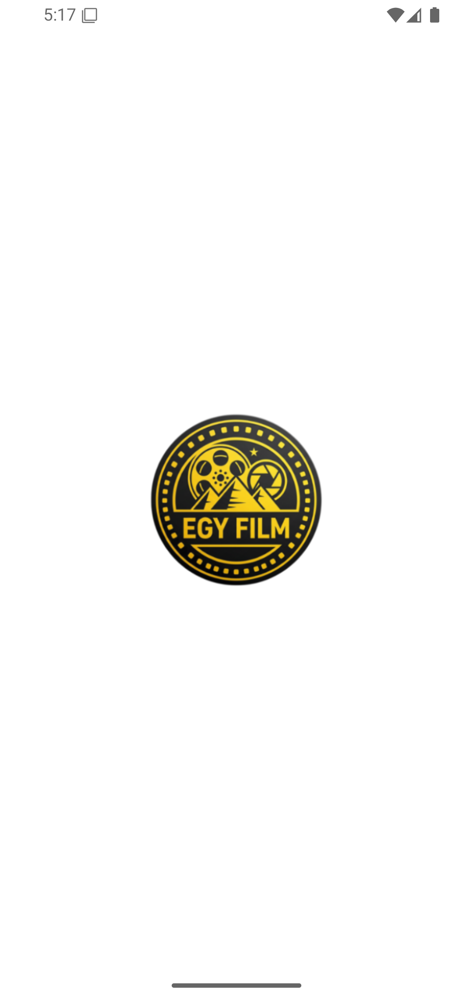 | 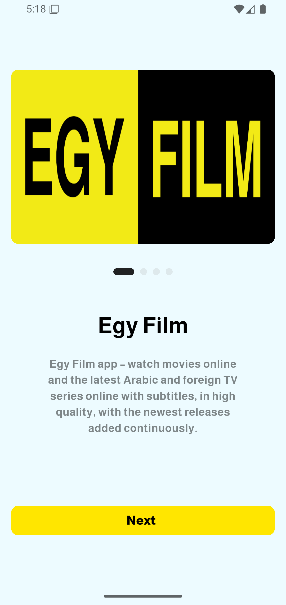 | 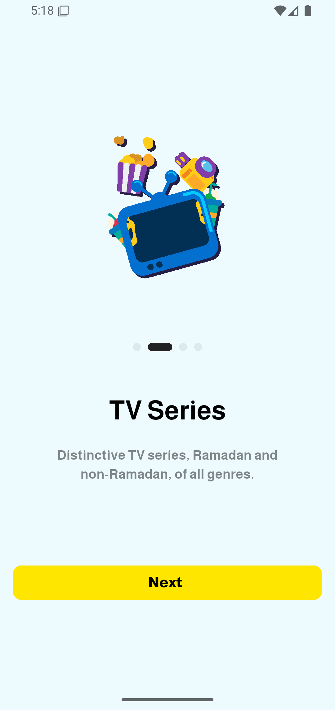 |

| Onboarding 3: Movies | Onboarding 4: Plays |
| :---: | :---: |
| 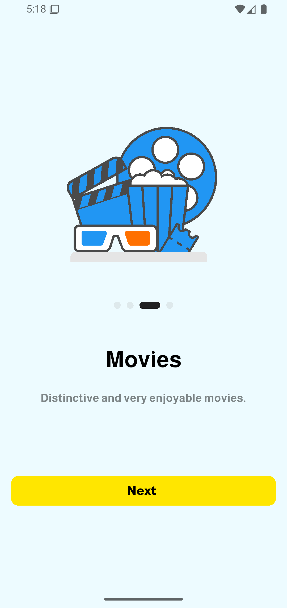 | 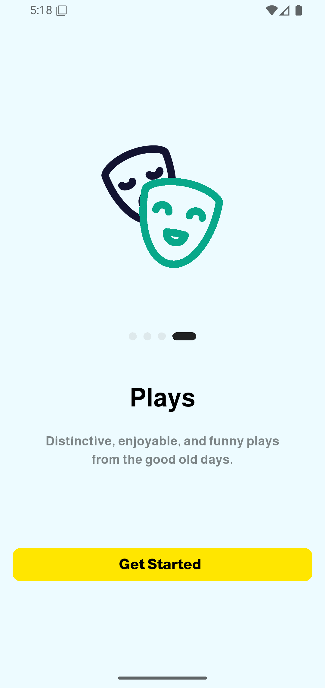 |

---

### 🔐 Authentication & Password Recovery

| Sign In / Login | Create Account / Sign Up | Forgot Password |
| :---: | :---: | :---: |
| 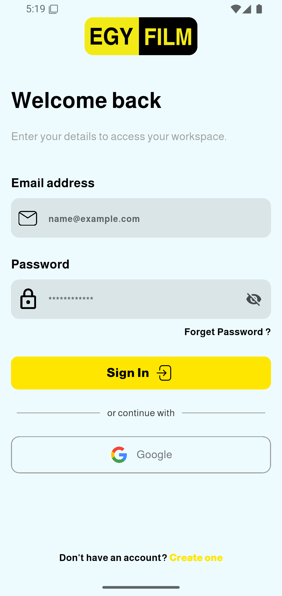 | 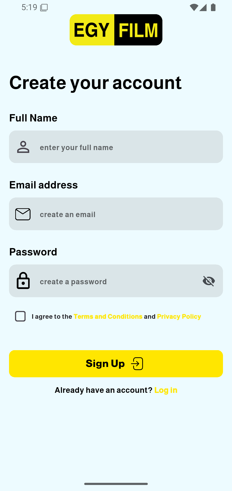 | 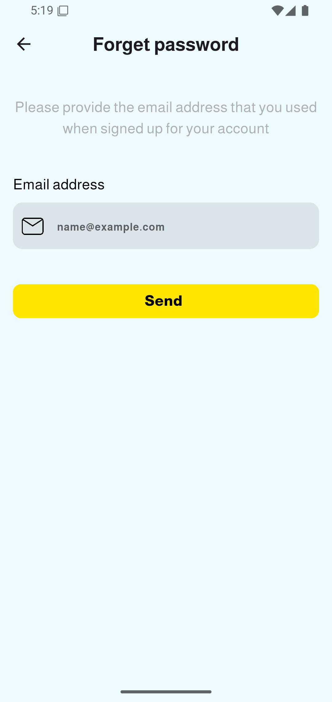 |

| Email OTP Verification | Reset Password | Reset Success |
| :---: | :---: | :---: |
| 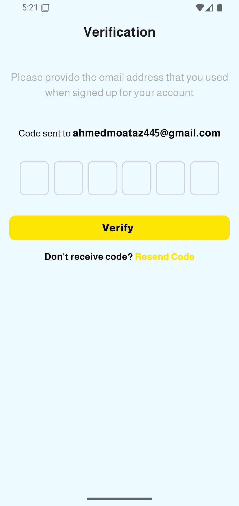 | 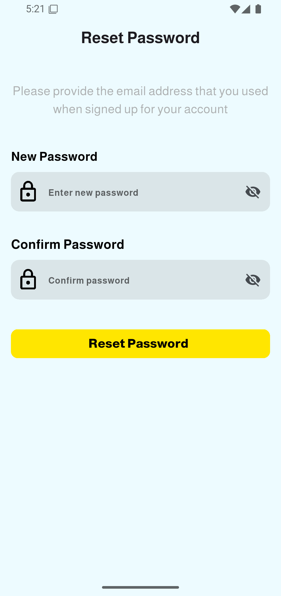 | 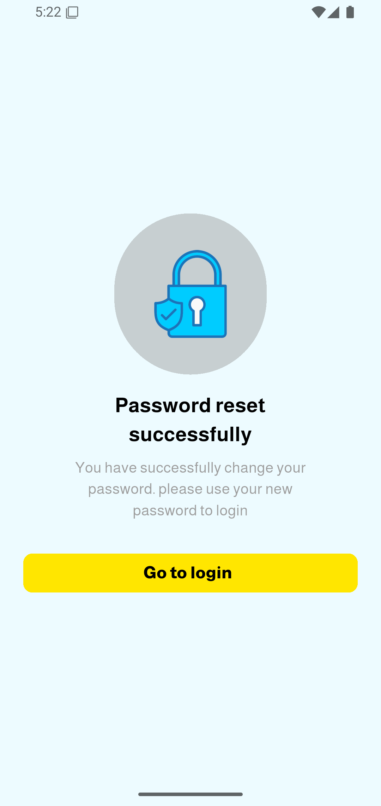 |

---

### 🍿 Home & Categories (Movies, TV Series, Plays)

| Movies Section | TV Series Section | Egyptian Plays (مسرحيات) |
| :---: | :---: | :---: |
| 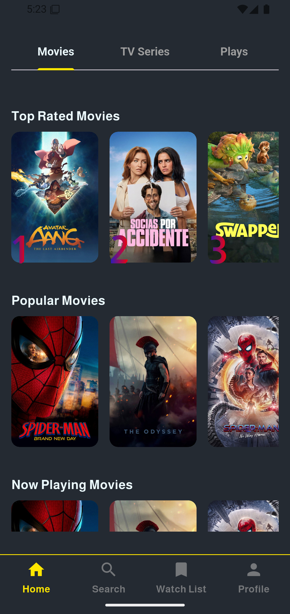 | 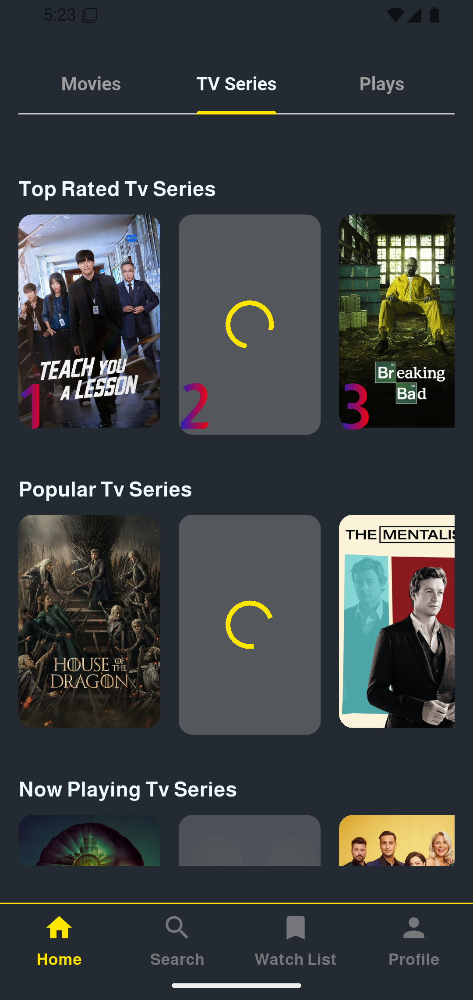 | 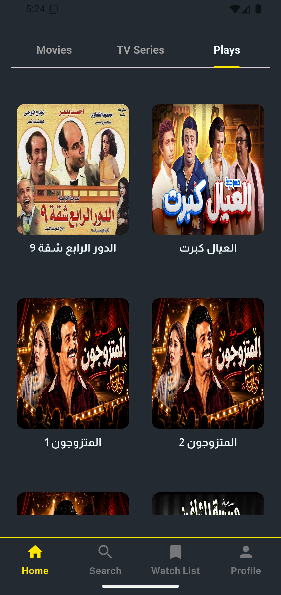 |

---

### 🎥 Media Details & Video Trailers

| Media Details & YouTube Trailer |
| :---: |
| 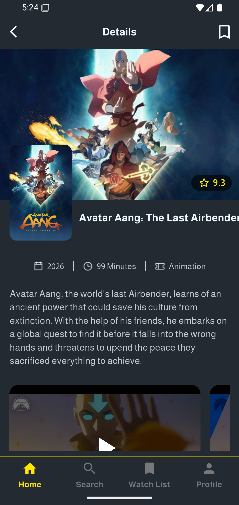 |

---

### 🔍 Search & Filtering

| Search Movies | Search TV Series |
| :---: | :---: |
| 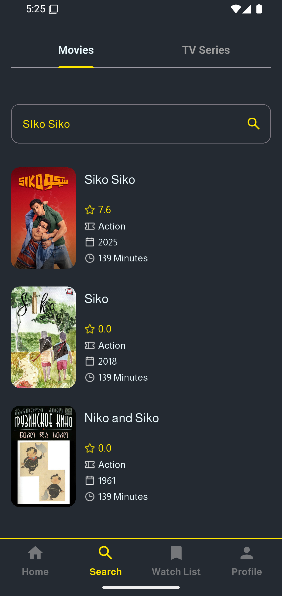 | 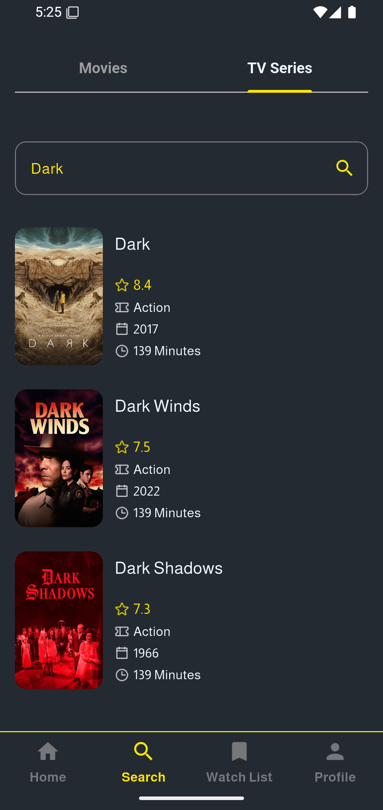 |

---

### 📑 Watchlist & Profile Management

| Watchlist (Saved Movies) | Watchlist (Empty State) | Profile & Language Settings |
| :---: | :---: | :---: |
| 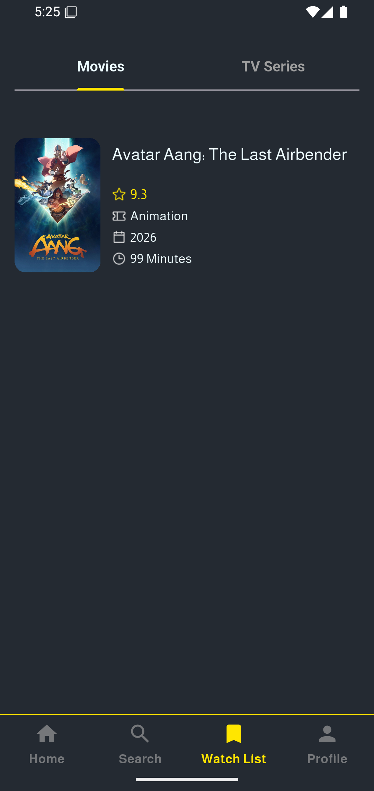 | 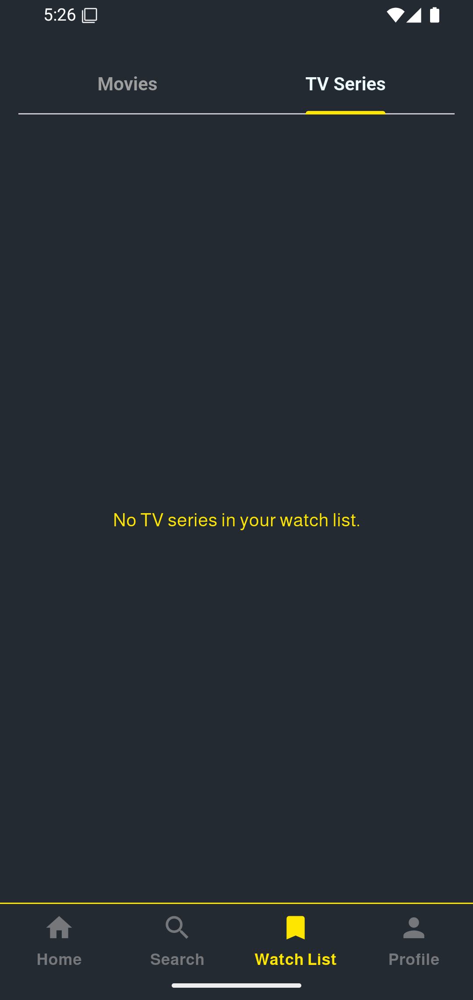 | 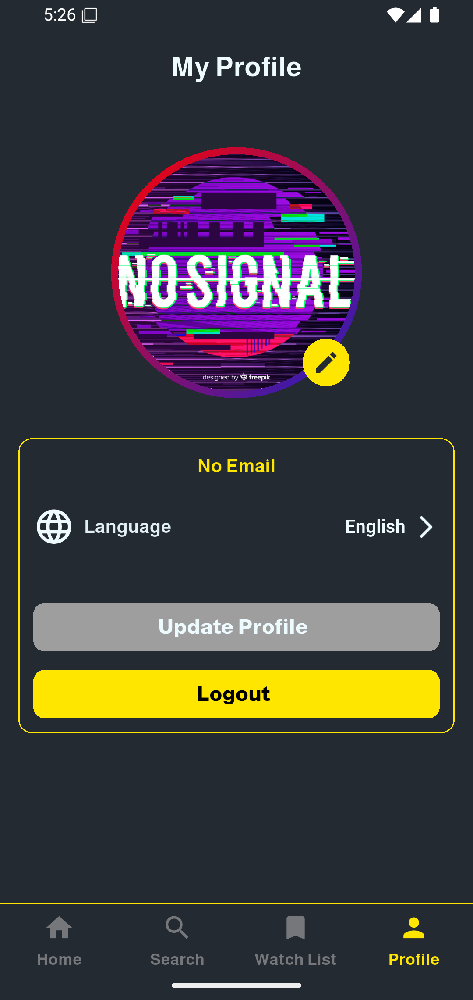 |

---

## ✨ Key Features

- **🎬 Multi-Tier Entertainment Catalog**:
  - Browse **Top Rated**, **Popular**, and **Now Playing / Airing Today** for Movies & TV Series.
  - Dedicated Egyptian Theatre Plays section with full-length video playback support.
- **🎥 Immersive Detail View & Trailing**:
  - Detailed metadata including rating stars, genres, release dates, runtime, overview, and similar recommendations.
  - Embedded **YouTube Player** for official trailers and **Appinio Video Player** for custom video streaming.
- **🔍 Live Search Engine**:
  - Real-time instant search with separate tabs for Movies and TV Shows.
- **💾 Offline-Ready Watchlist**:
  - High-performance local caching and persistent bookmarking powered by **Hive NoSQL DB**.
- **🛡️ Secure Multi-Method Authentication**:
  - Email/Password authentication with Firebase.
  - One-tap **Google Sign-In**.
  - **Supabase Email OTP Verification** for both sign-up verification and password recovery.
  - Encrypted credential caching via `flutter_secure_storage`.
- **🌐 Internationalization & RTL Support**:
  - Dual language support (**Arabic & English**) with instant runtime switching and bidirectional layout adjustments.
- **📶 Network Connectivity Monitoring**:
  - Real-time offline detection banner via `flutter_offline` alerting users when internet access is lost.
- **🎨 Modern Dark UI / UX**:
  - Responsive design tailored using `flutter_screenutil`.
  - Polished micro-animations with `animate_do`, `lottie`, and skeleton shimmer loaders with `skeletonizer`.
- **🔔 Push Notifications & Crash Tracking**:
  - **Firebase Cloud Messaging (FCM)** for background and foreground notifications.
  - **Firebase Crashlytics** integration for real-time error tracking.

---

## 🏛️ Architecture & Design Patterns

The codebase strictly adheres to Uncle Bob's **Clean Architecture** principles, maintaining clear separation of concerns, high testability, and maintainability:

```
lib/
├── core/                   # Shared utilities, constants, themes, routes, DI, and common widgets
│   ├── utils/              # App assets, colors, constants, routes, dialogs, toasts, storage
│   ├── view/               # Shared views and base widgets
│   └── view_model/         # Global cubits (e.g. LanguageCubit)
│
└── features/               # Feature-based modules (Feature-First approach)
    ├── auth/               # Authentication feature (Data, Domain, Presentation)
    ├── home/               # Home feature (Movies, TV Series, Plays)
    ├── search/             # Search feature
    ├── watch_list/         # Watchlist / Favorites feature (Hive persistence)
    └── profile/            # User profile & settings feature
```

### Layer Breakdown per Feature:
1. **Data Layer (`data/`)**:
   - **Data Sources / API**: Direct network communication (`http`, Firebase, Supabase).
   - **Models / DTOs**: Serialization/deserialization of API JSON objects and Hive TypeAdapters.
   - **Repositories Implementation**: Coordinates remote and local data sources.
2. **Domain Layer (`domain/`)**:
   - **Entities**: Pure business objects independent of external frameworks.
   - **Repository Interfaces**: Abstract contracts for data access.
   - **Use Cases**: Encapsulated business rules and application interactions.
3. **Presentation Layer (`presentation/`)**:
   - **State Management**: **BLoC / Cubit** managing UI state transitions.
   - **Views & Widgets**: Screen widgets and reusable UI components.

---

## 🛠️ Tech Stack & Packages

| Category | Package | Description |
|---|---|---|
| **Core Framework** | `flutter` | UI Software Development Kit |
| **Language** | `dart` (SDK ^3.9.2) | Programming language |
| **State Management** | `flutter_bloc` (^9.1.1) | Predictable state management with BLoC & Cubit pattern |
| **Dependency Injection** | `get_it` (^9.2.1) | Service Locator for dependency inversion |
| **Networking** | `http` (^1.6.0) | REST API client for TMDB integration |
| **Cloud & Auth** | `firebase_core`, `firebase_auth`, `cloud_firestore` | Firebase ecosystem for authentication & cloud storage |
| **OAuth** | `google_sign_in` (^6.3.0) | Google OAuth authentication |
| **Backend & Storage** | `supabase_flutter` (^2.12.2) | Supabase for sending email OTPs and avatar storage |
| **Local Database** | `hive`, `hive_flutter` | Lightweight, blazing fast key-value NoSQL database |
| **Secure Storage** | `flutter_secure_storage` (^10.3.1) | Keychain / KeyStore encrypted token storage |
| **Preferences** | `shared_preferences` (^2.5.5) | Local persistence for user settings and preferences |
| **Video Playback** | `youtube_player_flutter`, `appinio_video_player` | YouTube trailer integration and custom video playback |
| **Image Caching** | `cached_network_image` (^3.4.1) | Network image caching with placeholders and error handling |
| **UI Responsiveness** | `flutter_screenutil` (^5.9.3) | Adapting screen size and font scaling |
| **Animations & UI** | `animate_do`, `lottie`, `skeletonizer` | Micro-interactions, vector Lottie animations, and shimmer placeholders |
| **Notifications** | `firebase_messaging` (^16.1.3) | Firebase Cloud Messaging push notification handler |
| **Localization** | `flutter_localizations`, `intl` | Arabic & English localization with RTL support |
| **Network Status** | `flutter_offline` (^6.0.0) | Real-time internet connection state monitor |
| **Feedback UI** | `toastification` (^3.0.3) | Modern toast notifications |

---

## 📁 Project Directory Structure

```plaintext
Egy-Film/
├── android/                    # Android native project files
├── ios/                        # iOS native project files
├── assets/                     # App assets
│   ├── demo/                   # App demonstration video (egy-film.mp4)
│   ├── fonts/                  # Almarai, Noto Naskh Arabic, Rubik fonts
│   ├── icons/                  # SVG and PNG custom icons
│   ├── images/                 # App logos, security graphics, splash art
│   ├── lotties/                # Lottie animation JSON files
│   └── screenshots/            # Showcase app screenshots
├── lib/
│   ├── core/                   # Core application layer
│   │   ├── utils/              # Colors, constants, routes, dialogs, GetIt setup
│   │   ├── view/               # Onboarding and common shared widgets
│   │   └── view_model/         # Global cubits (LanguageCubit)
│   ├── features/
│   │   ├── auth/               # Login, Register, OTP verification, Password Reset
│   │   ├── home/               # Movies, TV Series, Egyptian Plays feeds & details
│   │   ├── profile/            # User profile, photo update, language switcher
│   │   ├── search/             # Live query search for movies and TV series
│   │   └── watch_list/         # Hive-backed watchlist feature
│   ├── l10n/                   # Translation files (intl_en.arb, intl_ar.arb)
│   ├── generated/              # Auto-generated localization code
│   ├── firebase_options.dart   # Firebase configuration
│   └── main.dart               # App entry point & initialization
├── pubspec.yaml                # App dependencies & asset definitions
└── README.md                   # Project documentation
```

---

## 🚀 Getting Started & Installation

### Prerequisites

1. **Flutter SDK**: `>=3.0.0` ([Flutter Installation Guide](https://docs.flutter.dev/get-started/install))
2. **Dart SDK**: `>=3.9.0`
3. **Android Studio** or **VS Code** with Flutter and Dart extensions
4. Android SDK (API Level 21+) or iOS (iOS 12+)

### Step-by-Step Setup

1. **Clone the Repository**:
   ```bash
   git clone https://github.com/Ahmed-Moataz-glitch/Egy-Film.git
   cd Egy-Film
   ```

2. **Install Dependencies**:
   ```bash
   flutter pub get
   ```

3. **Generate Code & Hive Adapters** (if needed):
   ```bash
   dart run build_runner build --delete-conflicting-outputs
   ```

4. **Run the Application**:
   ```bash
   # Run on connected device or emulator
   flutter run
   ```

### Production Build

```bash
# Build Android APK
flutter build apk --release

# Build Android App Bundle (AAB)
flutter build appbundle --release

# Build iOS IPA
flutter build ios --release
```

---

## ⚙️ Environment Configuration

- **Firebase**: Ensure you configure your Firebase project with `flutterfire configure` or maintain the `firebase_options.dart` and `google-services.json` / `GoogleService-Info.plist` files.
- **Supabase**: Set up your Supabase project URL and anon public key in `lib/core/utils/app_constants.dart` for email OTP service and profile image storage.
- **TMDB API**: Set up your TMDB v3 API key in `lib/core/utils/app_constants.dart`.

---

## 🗺️ Roadmap

- [x] Complete Clean Architecture structure
- [x] Firebase Authentication & Google Sign-In
- [x] Supabase OTP verification & Profile avatar upload
- [x] Movies & TV Series integration with TMDB API
- [x] Egyptian Plays showcase with video player
- [x] YouTube trailer player integration
- [x] Hive offline Watchlist
- [x] English & Arabic bilingual localization (RTL)
- [x] Push notification handler via Firebase Messaging
- [ ] Add Cast & Crew full detail pages
- [ ] Download media trailers for offline preview
- [ ] Personalized recommendations based on viewing history

---

## 🤝 Contributing

Contributions, issues, and feature requests are welcome!

1. Fork the Project
2. Create your Feature Branch (`git checkout -b feature/AmazingFeature`)
3. Commit your Changes (`git commit -m 'Add some AmazingFeature'`)
4. Push to the Branch (`git push origin feature/AmazingFeature`)
5. Open a Pull Request

---

## 📄 License

This project is licensed under the **MIT License** — see the [LICENSE](LICENSE) file for details.

---

## 📬 Author & Contact

**Ahmed Moataz**  
[](https://github.com/Ahmed-Moataz-glitch)
[](https://linkedin.com/in/)

<div align="center">
  Made with ❤️ using <b>Flutter</b> — ⭐ Star this repo if you found it helpful!
</div>
